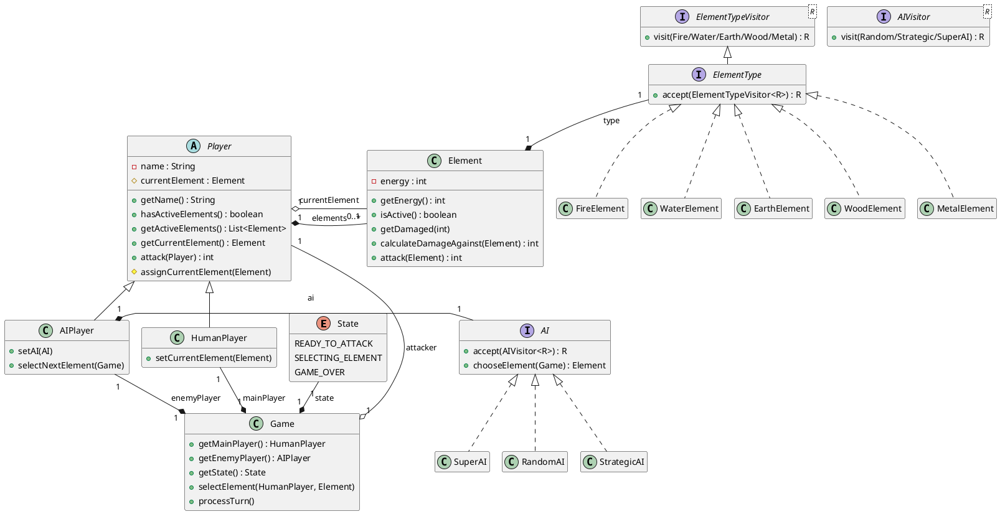
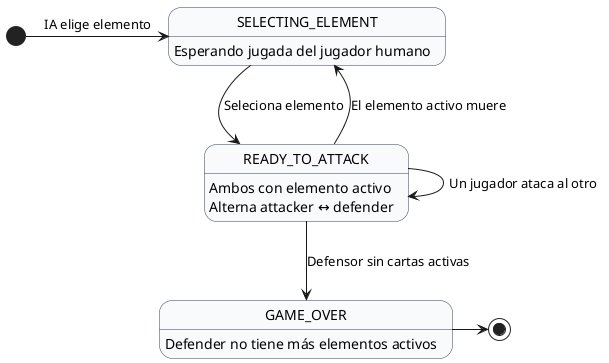

# Unfathomable Janken

Un sistema de combate táctico elemental por turnos en consola

<div class="pt-8 text-lg opacity-80">
  <div class="font-semibold">Mateus Cordeiro, Ian Bertellotti y Joaquín Forni</div>
  <div class="text-sm opacity-60 mt-2">Programación Orientada a Objetos — Ingeniería en Sistemas de Información</div>
</div>

---

# El Sistema Elemental — Wu Xing (五行)

Extensión del clásico *Piedra, Papel o Tijera* a **5 elementos** con relaciones asimétricas de ventaja mayor y menor.

<div class="grid grid-cols-2 gap-8 items-center mt-4">
<div class="space-y-3 text-sm leading-snug">

<div class="opacity-90">
  El <b>Wu Xing</b> (<i>"Cinco Fases"</i>) es un antiguo sistema conceptual chino que modela las interacciones entre los fenómenos mediante dos ciclos complementarios:
</div>

<div class="p-3.5 rounded-lg border border-emerald-500/30 bg-emerald-500/5">
  <div class="font-bold text-emerald-400 text-sm">🔄 Ciclo de Generación (Sheng)</div>
  <div class="text-xs opacity-90 mt-1 leading-relaxed">
    Cada elemento nutre o genera al siguiente en el ciclo exterior (Madera → Fuego → Tierra → Metal → Agua → Madera), definiendo interacciones de desventaja moderada (30 de daño).
  </div>
</div>

<div class="p-3.5 rounded-lg border border-amber-500/30 bg-amber-500/5">
  <div class="font-bold text-amber-400 text-sm">⭐ Estrella de Control (Ke)</div>
  <div class="text-xs opacity-90 mt-1 leading-relaxed">
    Cada elemento domina, restringe o supera a otro en la estrella interior (Fuego → Metal → Madera → Tierra → Agua → Fuego), definiendo los <b>counters mayores (60 de daño)</b>.
  </div>
</div>

</div>

<div class="flex flex-col items-center justify-center">
  
</div>
</div>

---

# Equilibrio Matemático y Matriz de Daño Simétrica

Cada elemento posee un **counter mayor (60)**, un **counter menor (40)**, un **impacto neutral (35)** y **dos desventajas (30 y 20)**.

<div class="grid grid-cols-3 gap-5 items-center mt-4">
<div class="col-span-2 compact-table">

|              |     🔥     |     💧     |     🪨     |     🪵     |     🔩     | **Infligido** |
|:-------------|:----------:|:----------:|:----------:|:----------:|:----------:|:-------------:|
| 🔥           |     35     |     20     |     30     |     40     |   **60**   |  **185 OUT**  |
| 💧           |   **60**   |     35     |     20     |     30     |     40     |  **185 OUT**  |
| 🪨           |     40     |   **60**   |     35     |     20     |     30     |  **185 OUT**  |
| 🪵           |     30     |     40     |   **60**   |     35     |     20     |  **185 OUT**  |
| 🔩           |     20     |     30     |     40     |   **60**   |     35     |  **185 OUT**  |
| **Recibido** | **185 IN** | **185 IN** | **185 IN** | **185 IN** | **185 IN** | **185 = 185** |

</div>

<div class="p-4 rounded-lg border border-gray-500/30 bg-gray-500/10 text-xs leading-relaxed space-y-2">
  <div class="font-bold text-sm text-amber-400">⚖️ Simetría Global</div>
  <div>
    Cada elemento inflige exactamente <b>185 puntos</b> de daño total frente al resto y recibe exactamente <b>185 puntos</b>.
  </div>
  <div class="opacity-85">
    Ninguna carta posee una ventaja intrínseca global: el valor estratégico de un elemento depende dinámicamente del mazo activo restante del oponente.
  </div>
</div>
</div>

---

# Arquitectura y Estructura de Clases (POO)

Diseño desacoplado en tres módulos: **Coordinación y Jugadores**, **Elementos (Double Dispatch)** y **Estrategias IA (Strategy)**.

<div class="uml-box mt-2">



</div>

---

# Máquina de Estados del Juego (`Game.State`)

`Game` modela el ciclo de vida del combate mediante una máquina de estados explícita, desacoplada de la interfaz gráfica:

<div class="grid grid-cols-3 gap-5 mt-5">

<div class="p-4 rounded-lg border border-blue-500/30 bg-blue-500/5 space-y-2">
  <div class="font-bold text-sm text-blue-400">1. SELECTING_ELEMENT</div>
  <div class="text-xs opacity-90 leading-relaxed">
    <b>Estado inicial</b> de la partida luego de que la IA selecciona su primera carta.
  </div>
  <div class="text-xs opacity-85 leading-relaxed">
    El motor de dominio permanece a la espera de que el jugador humano elija un elemento activo.
  </div>
</div>

<div class="p-4 rounded-lg border border-amber-500/30 bg-amber-500/5 space-y-2">
  <div class="font-bold text-sm text-amber-400">2. READY_TO_ATTACK</div>
  <div class="text-xs opacity-90 leading-relaxed">
    Ambos jugadores tienen un elemento activo. La interfaz puede llamar un método para procesar un turno, lo que ejecuta un ataque y alterna los roles attacker ↔ defender:
  </div>
  <div class="text-xs opacity-85 leading-relaxed">
    • Si cae la carta de la IA, elige su reemplazo automáticamente y sigue en <code>READY_TO_ATTACK</code>.<br/>
    • Si cae la del jugador humano, vuelve a <code>SELECTING_ELEMENT</code>.
  </div>
</div>

<div class="p-4 rounded-lg border border-red-500/30 bg-red-500/5 space-y-2">
  <div class="font-bold text-sm text-red-400">3. GAME_OVER</div>
  <div class="text-xs opacity-90 leading-relaxed">
    <b>Estado terminal</b> alcanzado cuando el jugador defensor pierde su último elemento activo.
  </div>
  <div class="text-xs opacity-85 leading-relaxed">
    El juego se termina y muestra quien es el ganador, no se permiten más turnos.
  </div>
</div>

</div>

---

# Diagrama de Estados del Juego (`Game.State`)

<div class="uml-box mt-3">



</div>

---

# Patrones de Diseño OO — Sin condicionales de tipo

Resolución polimórfica de interacciones y vistas sin utilizar `if`/`else`, `switch` ni `instanceof`.

<div class="grid grid-cols-2 gap-6 mt-3 text-xs leading-snug">

<div class="p-4 rounded-lg border border-gray-500/30 bg-gray-500/5 space-y-2">
  <div class="font-bold text-sm text-amber-400">1. Double Dispatch en Combate (ElementType)</div>
  <div class="opacity-90 leading-relaxed">
    Cada <code>Element</code> se compone de un <code>ElementType</code> (<i>Composición sobre Herencia</i>), que extiende <code>ElementTypeVisitor&lt;Integer&gt;</code>:
  </div>

```java
public int calculateDamageAgainst(Element other) {
    return other.getType().accept(this.type);
}
```

  <div class="space-y-1.5 pt-1 opacity-90 leading-relaxed">
    <div><b>1° Dispatch:</b> <code>other.getType().accept(...)</code> resuelve polimórficamente el tipo del <b>defensor</b> (ej. <code>WaterElement</code>).</div>
    <div><b>2° Dispatch:</b> <code>visitor.visit(this)</code> invoca <code>visit(WaterElement)</code> en el <b>atacante</b> (ej. <code>FireElement</code> → retorna <code>20</code>).</div>
  </div>
</div>

<div class="p-4 rounded-lg border border-gray-500/30 bg-gray-500/5 space-y-2">
  <div class="font-bold text-sm text-blue-400">2. Patrón Visitor para Desacoplar Vistas</div>
  <div class="opacity-90 leading-relaxed">
    El paquete de dominio <code>game</code> no conoce colores, íconos ni textos de interfaz. La presentación implementa visitantes sobre el modelo:
  </div>
  <div class="space-y-2 opacity-90 leading-relaxed">
    <div>
      • <b><code>ElementTypeVisitor&lt;R&gt;</code>:</b><br/>
      &nbsp;&nbsp;◦ <code>ElementTypeIconVisitor</code> → <code>"🔥"</code>, <code>"💧"</code>, <code>"🪨"</code>, <code>"🪵"</code>, <code>"🔩"</code><br/>
      &nbsp;&nbsp;◦ <code>ElementTypeNameVisitor</code> → <code>"Fire"</code>, <code>"Water"</code>, ...<br/>
      &nbsp;&nbsp;◦ <code>ElementTypePaintVisitor</code> → Color de cada elemento
    </div>
    <div>
      • <b><code>LogItemVisitor&lt;String&gt;</code>:</b> Transforma eventos de dominio (<code>ElementAttackedLogItem</code>, <code>GameOverLogItem</code>) en texto de historial.
    </div>
    <div>
      • <b><code>AIVisitor&lt;String&gt;</code>:</b> <code>AINameVisitor</code> traduce cada estrategia <code>AI</code> a <code>"Easy"</code>, <code>"Medium"</code> o <code>"Hard"</code>.
    </div>
  </div>
</div>

</div>

---

# Patrón Strategy: Inteligencias Artificiales

`AIPlayer` delega la decisión en la interfaz `AI` (`chooseElement(Game)`), permitiendo intercambiar tres estrategias polimórficas:

<div class="grid grid-cols-3 gap-5 mt-5">

<div class="p-4 rounded-lg border border-gray-500/30 bg-gray-500/5 space-y-2">
  <div class="font-bold text-base">🎲 RandomAI (Fácil)</div>
  <div class="text-xs"><b>Enfoque:</b> Probabilístico puro.</div>
  <div class="text-xs opacity-85 leading-relaxed">
    Selecciona de manera uniforme cualquier elemento dentro de <code>getActiveElements()</code> sin evaluar el estado del tablero ni el elemento activo del rival.
  </div>
</div>

<div class="p-4 rounded-lg border border-blue-500/30 bg-blue-500/5 space-y-2">
  <div class="font-bold text-base text-blue-400">📈 StrategicAI (Medio)</div>
  <div class="text-xs"><b>Enfoque:</b> Algoritmo codicioso (<i>Greedy</i>).</div>
  <div class="text-xs opacity-85 leading-relaxed">
    Evalúa el elemento actual del oponente usando <code>calculateDamageAgainst(rival)</code> y elige la carta que maximiza el daño inmediato del turno, sin considerar la reserva futura.
  </div>
</div>

<div class="p-4 rounded-lg border border-amber-500/40 bg-amber-500/10 space-y-2">
  <div class="font-bold text-base text-amber-400">🧠 SuperAI (Difícil)</div>
  <div class="text-xs"><b>Enfoque:</b> Valor Residual Global.</div>
  <div class="text-xs opacity-85 leading-relaxed">
    Calcula el balance neto <code>∑ (daño infligido − recibido)</code> de cada carta contra <b>todo el mazo activo del rival</b>:<br/>
    • <b>Fase 1:</b> Prioriza rematar objetivos heridos gastando la carta de menor valor global.<br/>
    • <b>Fase 2:</b> Maximiza daño desempatando por menor utilidad residual.
  </div>
</div>

</div>

---

# Demostración del Razonamiento de `SuperAI`

Comparación táctica frente a un enfoque codicioso (*Greedy*) en una situación real de partida.

<div class="grid grid-cols-2 gap-6 items-center mt-4">
<div class="space-y-3">
  

  <div class="p-3 rounded-lg border border-gray-500/20 bg-gray-500/5 text-xs opacity-85 leading-relaxed">
    💡 Un algoritmo <i>Greedy</i> (<code>StrategicAI</code>) habría jugado <b>Madera</b> (60 de daño contra Tierra), desperdiciando 30 puntos de sobre-daño y exponiendo su mejor carta para los turnos siguientes.
  </div>
</div>

<div class="space-y-3">
  <div class="p-3 rounded border-l-4 border-amber-500 bg-gray-500/5">
    <div class="font-bold text-sm text-amber-400">1. El Estado</div>
    <div class="text-xs opacity-85 mt-1 leading-relaxed">
      El jugador humano tiene <b>Tierra a 30 HP</b>. En su reserva solo quedan cartas de <b>Agua</b> y <b>Tierra</b>.
    </div>
  </div>

  <div class="p-3 rounded border-l-4 border-red-500 bg-gray-500/5">
    <div class="font-bold text-sm text-red-400">2. El Movimiento</div>
    <div class="text-xs opacity-85 mt-1 leading-relaxed">
      <code>SuperAI</code> decide jugar <b>Fuego</b> (a pesar de que Fuego es débil frente a Agua y Tierra).
    </div>
  </div>

  <div class="p-3 rounded border-l-4 border-emerald-500 bg-gray-500/5">
    <div class="font-bold text-sm text-emerald-400">3. La Justificación Heurística</div>
    <div class="text-xs opacity-85 mt-1 leading-relaxed">
      Fuego inflige exactamente <b>30 puntos a Tierra</b> (remate letal exacto). Como Fuego tiene el peor balance global frente al mazo futuro del rival (Agua y Tierra), <code>SuperAI</code> sacrifica su recurso menos útil y preserva sus cartas fuertes.
    </div>
  </div>
</div>
</div>

---

# Conclusiones y Logros de Diseño OO

<div class="grid grid-cols-2 gap-6 mt-5">

<div class="p-4 rounded-lg border border-emerald-500/30 bg-emerald-500/5 space-y-2.5">
  <div class="font-bold text-base text-emerald-400">🏛️ Arquitectura y Diseño OO</div>
  <div class="space-y-2 text-xs leading-relaxed opacity-90">
    <div>
      • <b>Cero condicionales de tipo:</b> Interacciones de combate resueltas íntegramente con <i>Double Dispatch</i> y vistas desacopladas con <i>Visitor Pattern</i>.
    </div>
    <div>
      • <b>Separación Dominio vs. Presentación:</b> El paquete <code>game</code> no posee ninguna dependencia de la interfaz gráfica ni de entrada/salida.
    </div>
    <div>
      • <b>Composición y Principios SOLID:</b> Separación entre estado mutable (<code>Element</code>, <code>AIPlayer</code>) y comportamiento/reglas (<code>ElementType</code>, <code>AI</code>, <code>NameGenerator</code>).
    </div>
  </div>
</div>

<div class="p-4 rounded-lg border border-blue-500/30 bg-blue-500/5 space-y-2.5">
  <div class="font-bold text-base text-blue-400">🚀 Validación y Extensibilidad</div>
  <div class="space-y-2 text-xs leading-relaxed opacity-90">
    <div>
      • <b>Superioridad de la Heurística:</b> El enfoque de valor residual global en <code>SuperAI</code> demostró superar consistentemente al enfoque codicioso (<code>StrategicAI</code>) y al azar (<code>RandomAI</code>).
    </div>
    <div>
      • <b>Principio Abierto/Cerrado (OCP):</b> La arquitectura permite incorporar nuevas estrategias de IA o nuevas vistas implementando las interfaces existentes sin modificar el dominio.
    </div>
    <div>
      • <b>Pruebas Unitarias:</b> Validación automatizada de las estrategias de IA, invariantes de <code>Player</code> y simetría de la matriz de daño.
    </div>
  </div>
</div>

</div>
